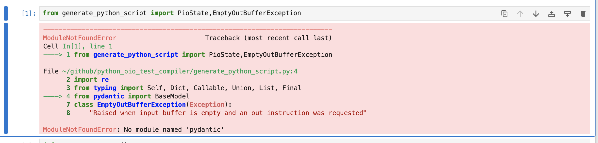

## Notebook and Python class to test PIO assembly

### SETUP

1. install [poetry](https://python-poetry.org/docs/#installing-with-the-official-installer)
   package manager

   ```bash
   curl -sSL https://install.python-poetry.org | python3 -
   ```

2. run `poetry install`

3. to start the jupyter notebook run `poetry run jupyter notebook main.ipynb`

### Using the Notebook

- when you first start up the notebook you may get this error:
  
- just press this button at the top:
  

### Using the class

the class that can execute the pio code is `PioState` in this file:
[generate_python_script.py](generate_python_script.py)

example:
```python
from generate_python_script import PioState,EmptyOutBufferException

def get_program_text() -> str:
    with open("test.pio", "r") as file1:
        # Reading from a file
        return file1.read()
# read the pio file into a string
program:str = get_program_text()

# 32 bit integer a la what is in the pico file
data:int = 0b01101011110000111110100000010110
# the out buffer is basically the list of 32 bit integers that is fed to the pio
# the first integer is the one that sets y per our normal code
out_buffer=PioState.create_out_buffer([0,data])
# state is what controls running the program.
state = PioState.start(program=program, out_buffer=out_buffer)
# this steps through the execution, one call of this is equivalent (or should be) to the pio executing
state.process_next_step()
# if state.process_next_step() raises EmptyOutBufferException stop
try:
    while True:
        state.process_next_step()
except EmptyOutBufferException:
    print("DONE")

# contents of the x, y registers at this point in execution
state.x, state.y
# if the pin controlled by the pio is high or low
state.internal_pin 
# how many instructions/waits have happened
state.step 


```


 